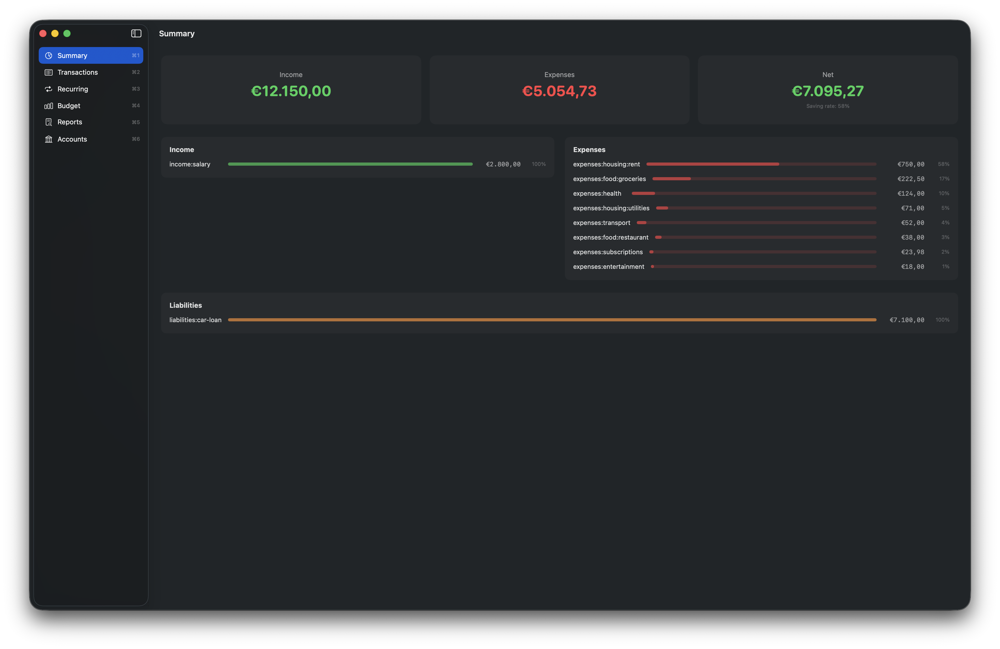
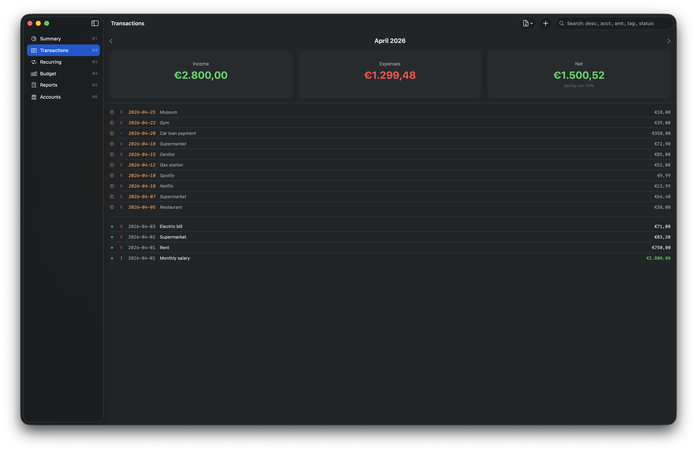
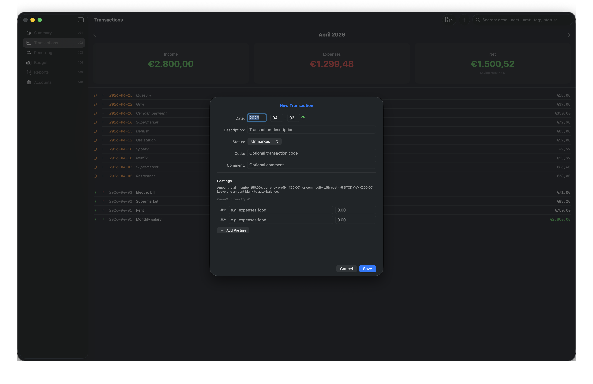
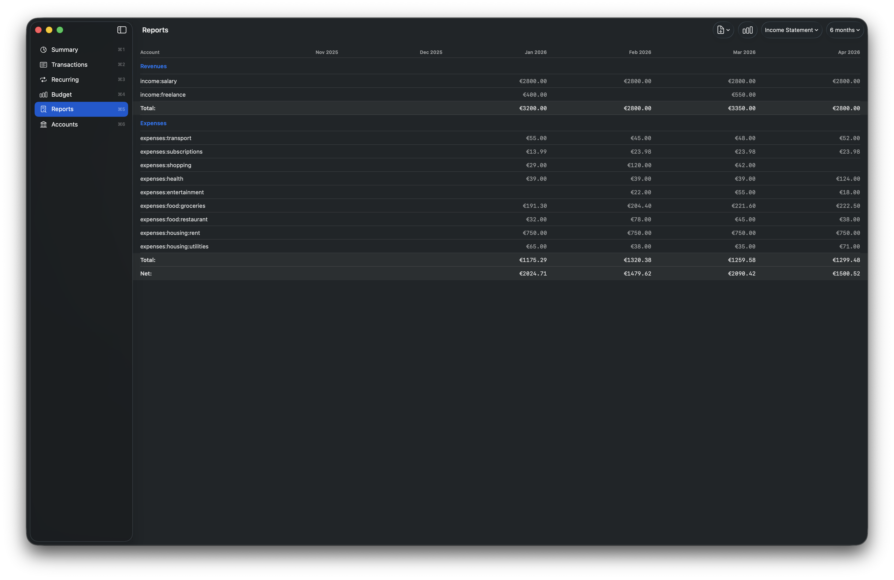
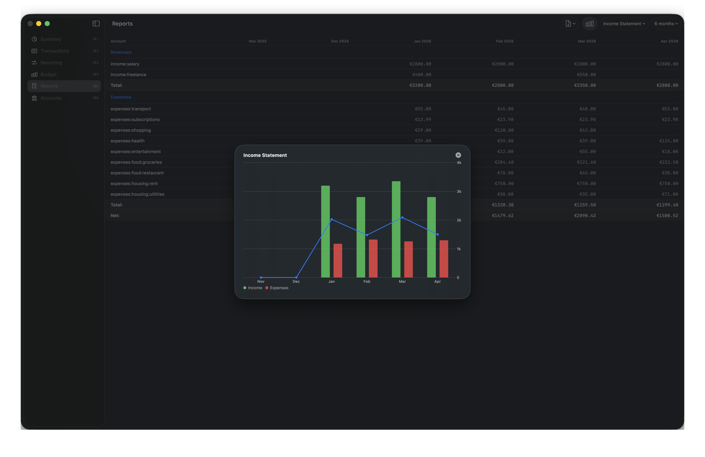
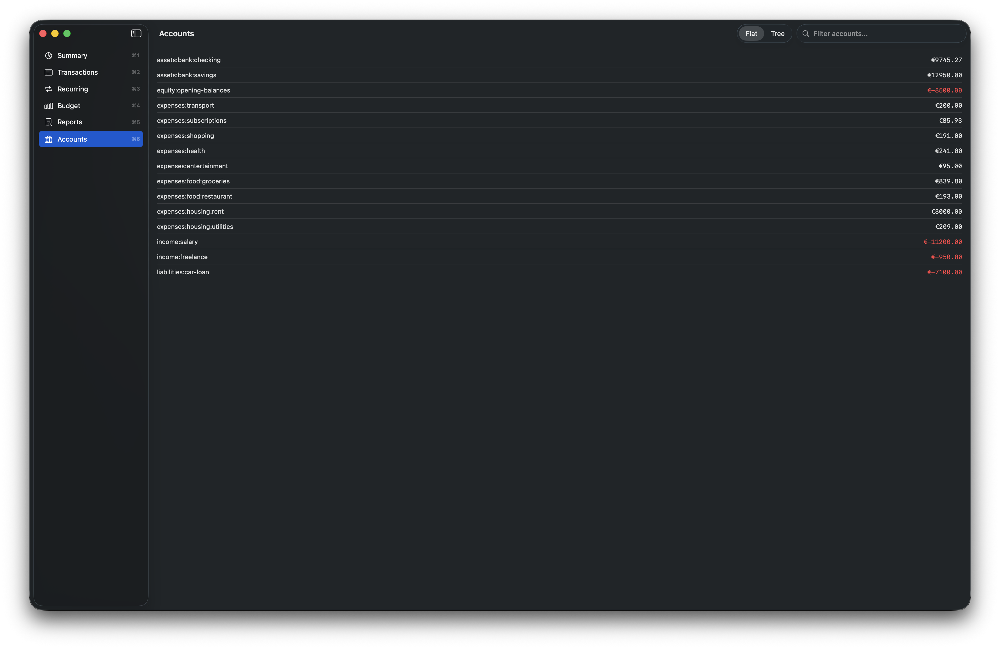

# hledger for Mac

[](https://github.com/thesmokinator/hledger-macos/actions/workflows/test.yml)
[](https://github.com/thesmokinator/hledger-macos/releases/latest)
[](LICENSE.md)


A native macOS app for [hledger](https://hledger.org) plain-text accounting. Manage transactions, budgets, recurring rules, view summaries, track investments, and generate financial reports — all from a native SwiftUI interface.

Built with Swift and SwiftUI. Requires macOS 26+.



| | | |
|:---:|:---:|:---:|
| [](screenshots/02.png) | [](screenshots/03.png) | [](screenshots/04.png) |
| Transactions | New transaction | Income Statement |
| [](screenshots/05.png) | [](screenshots/06.png) | |
| Income Statement chart | Accounts | |

## Download

Download the latest release from the [Releases](https://github.com/thesmokinator/hledger-macos/releases) page. The `.dmg` is signed and notarized.

## Requirements

- macOS 26+
- [hledger](https://hledger.org/install.html) installed (`brew install hledger`)
- Optional: [pricehist](https://pypi.org/project/pricehist/) for investment market values

## Features

- **Summary dashboard** — income/expenses/net with saving rate, configurable bar charts (dynamic/fixed), breakdowns, liabilities, investment portfolio
- **Transaction management** — list, create, edit, clone, delete with month navigation and smart search
- **Budget tracking** — define monthly budget rules, compare actual vs budget with usage colors and column headers
- **Recurring transactions** — manage periodic rules (daily, weekly, monthly, etc.) with batch generation
- **Financial reports** — Income Statement, Balance Sheet, Cash Flow with multi-period tables, chart overlay, and persistent defaults
- **Account browser** — flat and tree views with locale-formatted balances
- **Investment tracking** — portfolio positions, book values, and market prices via pricehist
- **AI Assistant** — on-device AI chat powered by Apple Intelligence with hledger tool calling (experimental)
- **Smart search** — hledger query syntax with suggestions (`desc:`, `acct:`, `amt:`, `tag:`, `status:`)
- **Multi-commodity support** — handles accounts with balances in multiple currencies
- **Journal routing** — auto-detects glob (`YYYY/*.journal`), flat (`YYYY-MM.journal`), or single-file structure
- **Keyboard shortcuts** — full keyboard navigation across all sections
- **Export** — CSV and PDF export for transactions, budgets, and reports
- **Command Log** — debug panel showing every hledger command executed
- **Locale-aware formatting** — amounts displayed with system locale
- **Appearance** — System, Light, or Dark mode
- **i18n ready** — String Catalog for future translations

## Stack

- **Swift / SwiftUI** — native macOS UI
- **SwiftUI Charts** — financial report visualizations
- **Apple Foundation Models** — on-device AI with tool calling
- **hledger** — plain-text accounting CLI (must be installed separately)
- **Xcode 26+** — build system

## Journal File Resolution

The journal file is resolved in this order:

1. Path configured in Settings
2. `LEDGER_FILE` environment variable
3. `~/.hledger.journal`

Accepts a file path or a directory containing journal files (auto-detects `main.journal`).

## Examples

The [`examples/`](examples/) directory contains sample journals:

| Example | Description |
|---------|-------------|
| [`hledger-simple/`](examples/hledger-simple/) | Single-file journal with basic transactions, comments, balance assertions, multi-commodity |
| [`hledger-multi-file/`](examples/hledger-multi-file/) | Multi-file journal with glob routing and investments |
| [`multicommodity.journal`](examples/multicommodity.journal) | Multi-currency edge cases |

## Keyboard Shortcuts

| Shortcut | Action |
|----------|--------|
| Cmd+1 — Cmd+6 | Switch section (Summary, Transactions, Recurring, Budget, Reports, Accounts) |
| Cmd+N | New item (transaction, budget rule, or recurring rule depending on section) |
| Cmd+E | Edit selected item |
| Cmd+D | Clone transaction |
| Cmd+Delete | Delete selected item |
| Cmd+T | Go to current month |
| Cmd+R | Reload data |
| Cmd+, | Settings |
| Cmd+/ | Keyboard shortcuts panel |
| Cmd+Shift+A | Toggle AI Assistant |
| Cmd+Option+L | Command Log |
| Tab | Select first item in list |
| Left/Right arrows | Navigate months |

## Documentation

See the [Wiki](https://github.com/thesmokinator/hledger-macos/wiki) for full documentation.

## Architecture

```
Backend/
  AccountingBackend.swift     Protocol: the contract for any backend
  HledgerBackend.swift        hledger CLI implementation
  SubprocessRunner.swift      Async Process wrapper
  JournalWriter.swift         Append/replace/delete with backup+validate
  TransactionFormatter.swift  Transaction → journal text
  BudgetManager.swift         Budget rules CRUD (budget.journal)
  RecurringManager.swift      Recurring rules CRUD (recurring.journal)
  BinaryDetector.swift        CLI binary detection
  JournalFileResolver.swift   Journal file resolution chain

Models/                       Transaction, Posting, Amount, ChatMessage, etc.
Services/                     AppState, AIAssistant, HledgerTools, PriceService
Config/                       AppConfig, AmountFormatter, AmountParser, Theme
Views/
  MainWindow/                 ContentView, SidebarView, SummaryView
  Transactions/               TransactionsView, TransactionFormView
  Budget/                     BudgetView, BudgetFormView
  Recurring/                  RecurringView, RecurringFormView
  Reports/                    ReportsView, ReportChartOverlay
  Accounts/                   AccountsView (flat + tree)
  AI/                         AIChatOverlay, AIChatBubble, AIToggleButton
  Settings/                   SettingsView (General, Paths, Investments, AI, About)
  Onboarding/                 OnboardingView
  Shared/                     BreakdownBar, BreakdownRow, PostingRowField, AutocompleteField, SummaryCard, etc.
```

The backend is abstracted behind the `AccountingBackend` protocol, making the architecture extensible.

## Development

```bash
git clone https://github.com/thesmokinator/hledger-macos.git
cd hledger-macos
open hledger-macos.xcodeproj
```

Build and run with Xcode (Cmd+R). Run tests with Cmd+U.
